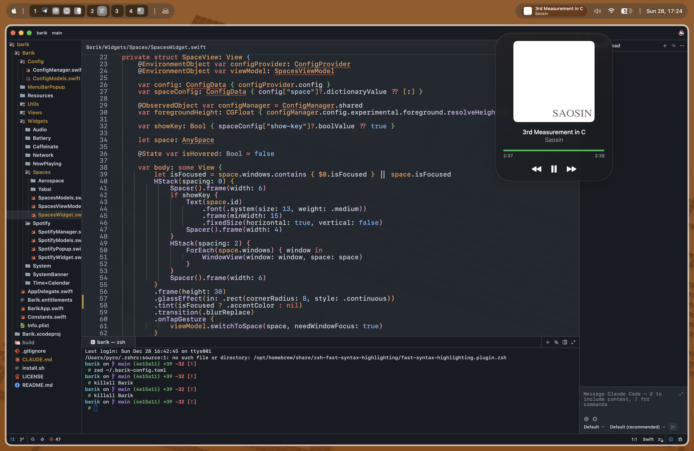
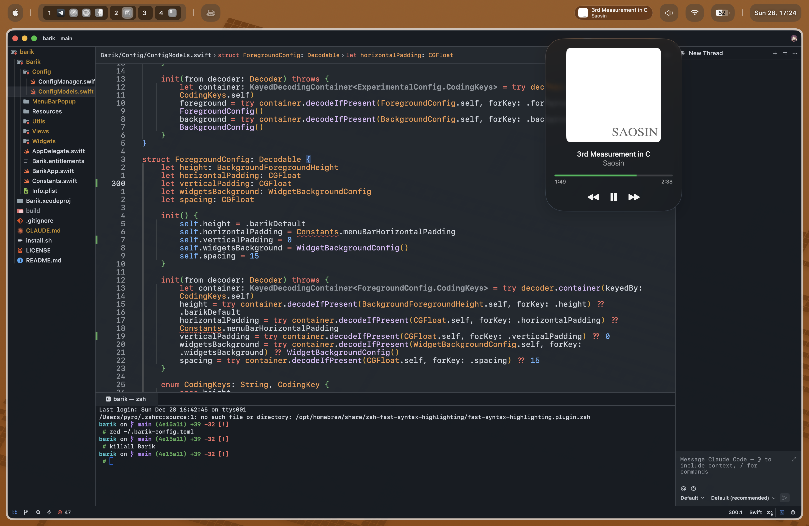
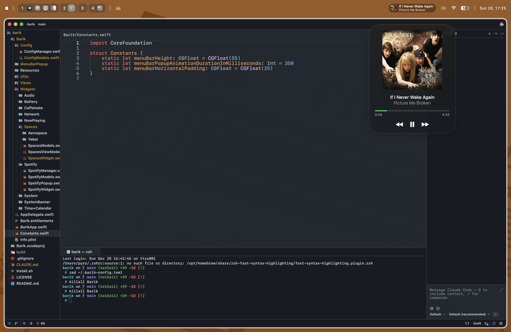

# Barik

A lightweight macOS menu bar replacement for use with [yabai](https://github.com/koekeishiya/yabai) or [AeroSpace](https://github.com/nikitabobko/AeroSpace).

> **Note:** This is a personal fork of (a personal fork :D) [this-fifo/barik](https://github.com/this-fifo/barik) tailored to my needs. Not accepting contributions. No promises of support or maintenance.

## Some examples:

